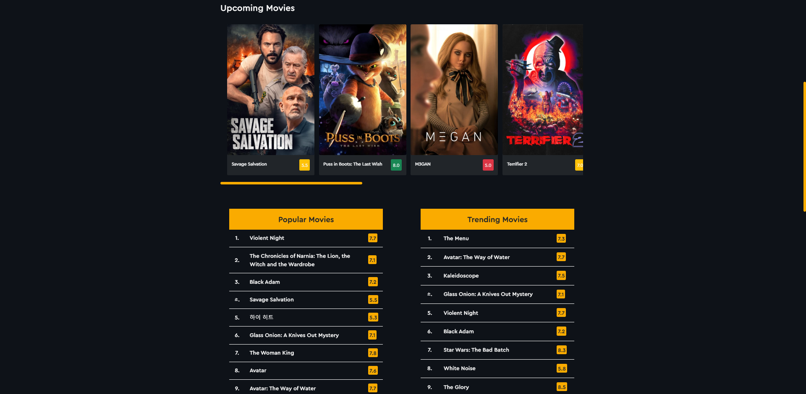

# Movie Watch

We choose Document database Technology because it has the following key features:

- Data is stored in documents. Documents map to objects which enables us to easily manipulate the contents with the programming languages we are using

- Document databases have a flexible schema, meaning that not all documents in a collection need to have the same fields, which allows us to create documents flexibly.

- Document databases are distributed, which allows for horizontal scaling (typically cheaper than vertical scaling) and data distribution. Document databases provide resiliency through replication.

- Querying through an API or query language: Document databases have an API or query language that allows us to execute the CRUD operations on the database.
